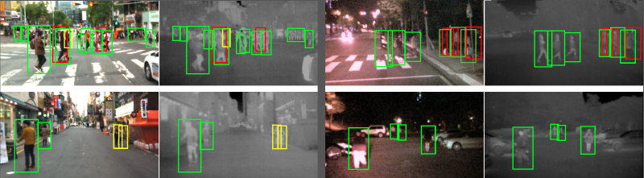
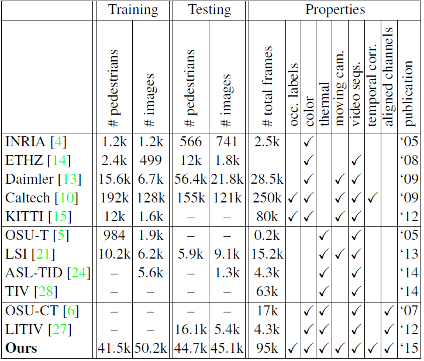

# KAIST Multispectral Pedestrian Detection Benchmark

## News (10/07/2021)
 Due to the confusion caused by original paper, people sometimes reported numbers in different evaluation settings. In this regard, people from Sejong University(Jiwon Kim, Hyeongjun Kim, Tae-Joo Kim and Yukyung Choi) created a leaderboard to facilitate fair comparison. So please use [this leaderboard](https://eval.ai/web/challenges/challenge-page/1247/) for your research. 
 
 


## Introduction
By [Soonmin Hwang](https://soonminhwang.github.io), [Jaesik Park](http://jaesik.info/), [Namil Kim](https://www.namilkim.com/), [Yukyung Choi](https://www.rcv.sejong.ac.kr/members/professor), In So Kweon at RCV Lab. (KAIST) [[Website](http://multispectral.kaist.ac.kr)]




We developed imaging hardware consisting of a color camera, a thermal camera and a beam splitter to capture the aligned multispectral (RGB color + Thermal) images. With this hardware, we captured various regular traffic scenes at day and night time to consider changes in light conditions.

The KAIST Multispectral Pedestrian Dataset consists of 95k color-thermal pairs (640x480, 20Hz) taken from a vehicle. All the pairs are manually annotated (person, people, cyclist) for the total of 103,128 dense annotations and 1,182 unique pedestrians. The annotation includes temporal correspondence between bounding boxes like Caltech Pedestrian Dataset. More infomation can be found in our CVPR 2015 [[paper](misc/CVPR15_Pedestrian_Benchmark.pdf)] [[Ext. Abstract](misc/CVPR15_Pedestrian_Benchmark_ext.pdf)].

&nbsp;
---
## Usage


Clone this repository and Download dataset

```bash
$ git clone --recursive https://github.com/soonminhwang/rgbt-ped-detection
$ cd rgbt-ped-detection

$ bash ./data/scripts/download_dataset_from_onedrive.sh ${YOUR_PATH_TO_DOWNLOAD_DATASET}

or

$ bash ./data/scripts/download_dataset_from_nas.sh ${YOUR_PATH_TO_DOWNLOAD_DATASET}

```


## Preview
[](https://youtu.be/a6KKFGNkNNE)
[](https://youtu.be/GSc9Lu3TQyQ)
[](https://youtu.be/AerQFTuMFsg)


## Toolbox
This repository includes an extension of [Piotr's Computer Vision Matlab Toolbox](https://github.com/pdollar/toolbox).
We modify some codes to deal with 4-ch RGB+T images, e.g. `${PIOTR_TOOLBOX}/channels/chnsCompute.m`.
All the modifications are in `libs/`.


&nbsp;
---

## Experimental results
Many researchers struggle to improve pedestrian detection performance on our benchmark. If you are interested, please see these works.

- FusionRPN + BDT [[CVPR '17](http://openaccess.thecvf.com/content_cvpr_2017_workshops/w3/papers/Konig_Fully_Convolutional_Region_CVPR_2017_paper.pdf)]: 29.83%
- Halfway Fusion [[BMVC '16](https://arxiv.org/abs/1611.02644)]: 36.22%
- LateFusion CNN [[ESANN '16](https://www.ais.uni-bonn.de/papers/ESANN_2016_Wagner.pdf)]: 43.80%
- CMT-CNN [[CVPR '17](https://arxiv.org/pdf/1704.02431.pdf)]: 49.55%
- Baseline, ACF+T+THOG [[CVPR '15](https://7b62b1cf-a-62cb3a1a-s-sites.googlegroups.com/site/pedestrianbenchmark/CVPR15_Pedestrian_Benchmark.pdf?attachauth=ANoY7coTuQT0B-N_QIGyxTx4HPg7QRp0lb9D3YJWwZ0KbKI3yf2cgINSlR2_rvMiIVwMOjNkOUqOqXQmwHT6C1ykXK6xDjOy08TQA0ZYSGQtXtH8OtNDwzRvkScbuojkqa15MfcN9oL6HY7ZgqihGB87gi6_bVcvbvHLPfzfjHmPj2UkvSNY9Ogcd092jsfMWhRyFw_8KSp6nJuPrfpbmZFLcFXmhMONHk5L0IBPPmxqj0PMCHRR_4H3YcMRaVgNt_qRsiwQqxjW&attredirects=0)]: 54.40%

 
Also, another researches to employ multi-modality are presented.

- Image-to-image translation [[Arxiv '17](https://arxiv.org/pdf/1703.00848v1.pdf)]
- Calibrations


## Related benchmarks


The horizontal lines divide the image types of the dataset (color, thermal and color-thermal). Note that our dataset is largest color-thermal dataset providing occlusion labels and temporal correspondences captured in a non-static traffic scenes.


**Please see our Place Recognition Benchmark.** [[Link](https://sites.google.com/site/alldaydataset/)]


## License

[](https://creativecommons.org/licenses/by-nc-sa/4.0/) [](https://opensource.org/licenses/BSD-2-Clause)

Please see [LICENSE.md](LICENSE.md) for more details.


## Citation
If you use our extended toolbox or dataset in your research, please consider citing:

	@inproceedings{hwang2015multispectral,
		Author = {Soonmin Hwang and Jaesik Park and Namil Kim and Yukyung Choi and In So Kweon},
		Title = {Multispectral Pedestrian Detection: Benchmark Dataset and Baselines},
		Booktitle = {Proceedings of IEEE Conference on Computer Vision and Pattern Recognition (CVPR)},
		Year = {2015}
	}


